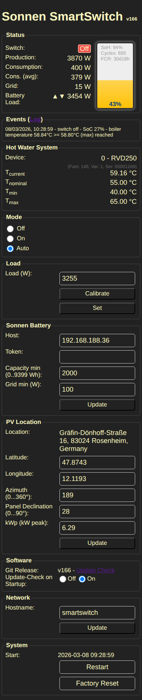
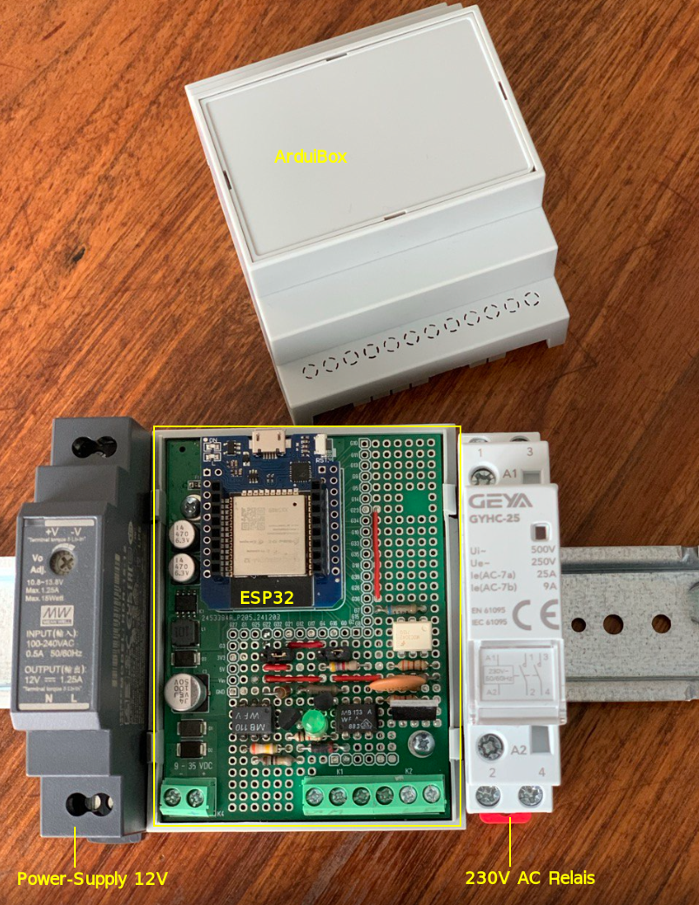
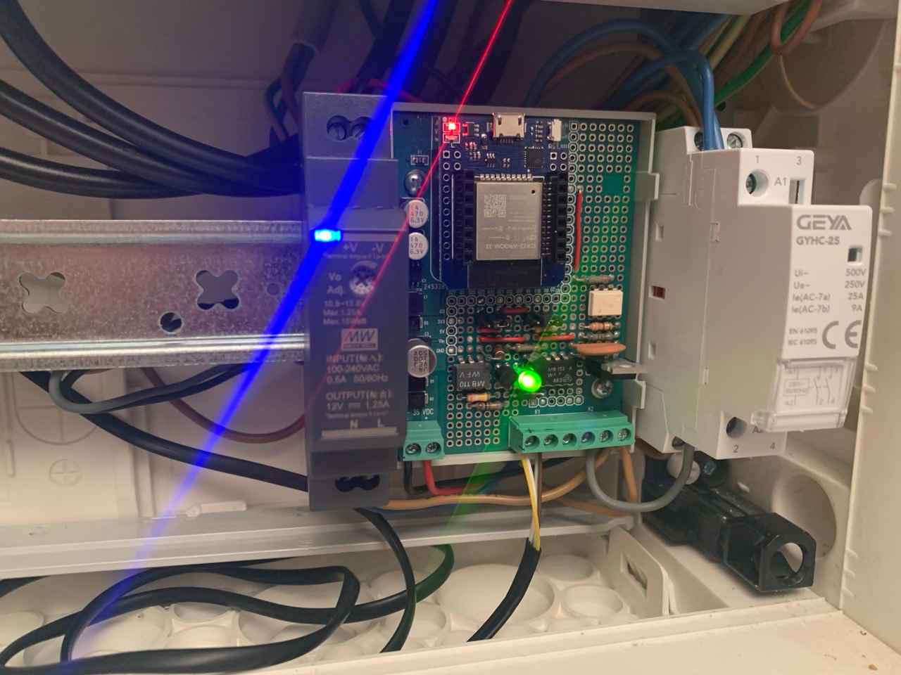
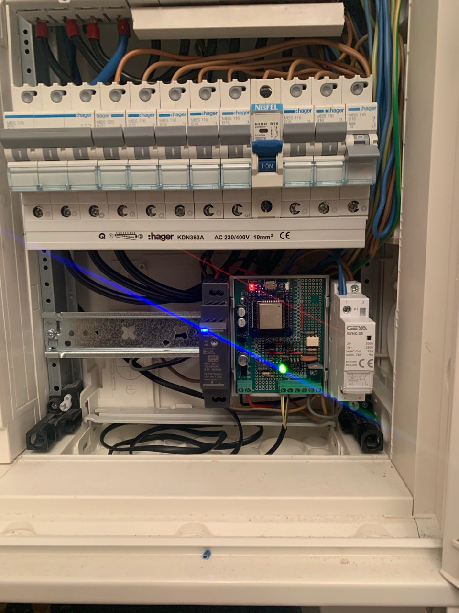

# Sonnen SmartSwitch
DIY sonnen battery controller based on ESP8266/ESP32 to drive a 3.3kW heater (Heißwasserspeicher-Einbauheizung) and integrates with the local hot water system.

## Features
- accesses the local hot water system (boiler system) via **LPB** to get the hot water system data - e.g. hot water temparature
- calculate battery capacity and surplus from **solar forecast** to optimize the self consumption
- local web interface to customize system parameters

## UI
<a href="public/ui_full.png">

</a>

## Software / Releases
the software supports ESP8266 and ESP32 modules, which can be build for the appropriate target platform. releases can be found at https://github.com/mlauke/smartswitch/releases/


## Hardware
the reference implementation (at my home) uses the following components
- Heater - https://www.austria-email.at/produkte/zubehoer/elektro-einbauheizung/reu-18-33/
- Hot Water Tank - https://www.austria-email.at/produkte/indirekt-beheizte-speicher/standspeicher/standspeicher-hr/hr-160/
- Sonnen Battery https://sonnen.de/stromspeicher/sonnenbatterie-10/
- Boiler System - Siemens RVD250 attached and connected to the ESP controller via the Local Process Bus (LPB)
- ESP8266/ESP32 controller modules
- ArduiBox housing https://www.az-delivery.de/en/products/arduibox-nodemcu-hutschienen-montage-und-anschluss-set
- DIN Rail Power supply +12V
- AC mains Triac cicuit to drive a 1NO Relay
- 1NO Relay (Schütz) https://www.reichelt.de/de/de/shop/produkt/schaltrelais_1_s_230_v_ac_16_a-155592

<details open align="center">
<summary>Housing</summary>
<a href="public/sss_arduibox.png">

</a>
<!--a href="public/sss_fusebox_big.png">

<a href="public/sss_fusebox.png">

</a>
</details>

### Thoughts
#### Why not using a TRIAC only solution?
Although Triacs have very low Rs_on values in nowadays, they become very hot depending on the load to drive. Using a 3.3kW heater will require a big heatsink as can be seen in the calculation below.

```bash
Pmax = (Tj,max - Tamb,max) / Rth

I = P / U = 3300W / 230 V = 14,35A
Rs_on (BTA25) = 0,16 Ohm
P_loss = U * I = Rs_on * I * I
P_loss = 0,16 Ohm * (14,35 A)²
P_loss = 32,95W

R_max = (T_max - T_env) / P_loss
R_max = (120°C - 40°C) / 33W
R_max = 2,42K/W
R_heatsink = R_max - R_jc = 2,42K/W - 1,7K/W
R_heatsink = 0,7K/W !!!
```

... heatsink with <=0,7K/W makes no sense, because we will waste too much power wasted just for heating the environment and maybe would "blow up" the overall system design in terms of size and housing the components.
therefore i decided to use a triac as switching device for a simple NO1 relais ("Schütz") which in turn will drive the load. the NO1 relais can directly placed next to the arduino case on our din rail.

#### Why not using a SSR?
as mentioned above, a SSR which can drive the 3,3kW load will become very hot if the load is switched on for longer heating periods. too hot to put the SSR together with the ESP controller board on a din rail inside of my houses fuse box.

# Features/Bugs
  - ❌ bug: flicker if battery is loading, min capacity is reached (e.g. 0 => 25%) and switch is enabled (hysterese)
  - ✅ bug: discharge not allowed but switch is triggered due to boiler min
  - ✅ detect battery training mode - support ticket at sonnen opened - workaround implemented "Set Point Priority" "Full Charge Request"
  - ✅ battery system data update every day or from time to time
  - ❌ feat: skip updateSwitch if not set to Auto
  - ❌ feat: wait or delay on reset/restart requests, make sure response is send
  - ❌ feat: suspend/sleep for a while (or double the amount of sleep)
    - if switch is off and will stay off
    - if boiler temp. is alread reached
  - ❌ feat: measure consumption avg per hour and week day and save to config for better long term approximation
  - ✅ feat: calibrate load automatically
  - ✅ feat: aggressive load - if battery is below min capacity, but production increases and surplus will full charge the battery during the day and remaining capacity is still enough to drive load

## Vision
- hardware
  - build a GaN (HEMT) AC Power Converter to dynamically control the "waste" of surplus power based on a bidirection GaN (HEMT) device => https://www.infineon.com/products/power/gallium-nitride/gan-bidirectional-switches/high-voltage-gan-bidirectional-switches e.g. https://www.infineon.com/part/IGLT65R055B2
